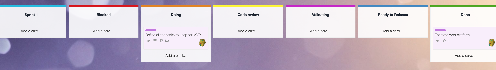
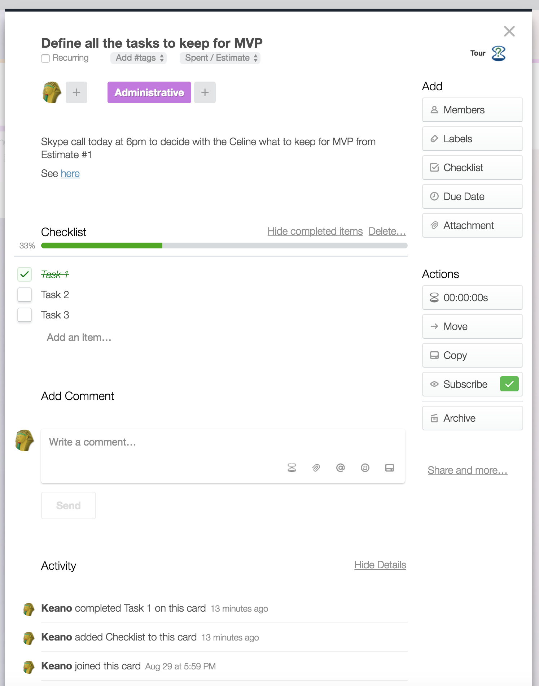

# trello-pimp
Pimping Trello look & feel for SCRUM workflows

**Board sample:**


**Card sample**


## Requirements
**This only supports Chrome (because some extensions are needed for now).**

Make sure to install the following Chrome extensions first:
 * **Stylebot**: https://chrome.google.com/webstore/detail/stylebot/oiaejidbmkiecgbjeifoejpgmdaleoha
 * **CJS (Custom Javascript for Web)**: https://chrome.google.com/webstore/detail/custom-javascript-for-web/poakhlngfciodnhlhhgnaaelnpjljija

## How does it work?

CJS is reading the title & list names in order to inject CSS classes to allow you to customize each single board and its lists.
Stylebot is taking care of the CSS to use for Trello, such as defining colors of the header bar, or top border colors on lists.

But you can do more!

## Stylebot configuration

**1.** Go in Stylebot Chrome extension options

**2.** Click on "*Add a new style...*" button

**3.** In "*URL (see patterns)*" input, type `^https://trello.com/`

**4.** Copy and paste the file content of `/stylebot/stylebot.css` into the textarea below

**5.** Hit "*Save*" button

## CJS configuration

**1.** Access http://www.trello.com

**2.** Click on CJS chrome extension icon

**3.** Make sure the dropdown at the top left is displaying `https://trello.com`

**4.** Check "*Enable cjs for this host*"

**5.** Just below, in the "*You can inject your own external scripts or predefined one" drop-down pick `jQuery 2.1.0`

**6.** Now copy and paste the file content of `/cjs/cjs.js` into the textarea below

**7.** Hit "*Save*" button

## Tweaking & Customization

### Customize a new board header

**CJS part**

Simply add a new property and its value in `boardStyles` variable.

This property should be representing the pattern the page's lowercased title must match (i.e. if the page title is "My Todos", the pattern can be `^My Todos$`)
This property's value should be representing the CSS class you want to inject for that board (i.e. if the page title is "My Todos", we could inject a CSS class name `my-todos-board`)

**Stylebot part**

Under `/* --- CUSTOM BOARD STYLES --- */` in the **stylebot.css** file, simply add a new style for this board header:
```
.my-todos-board .board-header {
    background: {desiredColor} ;
    // some other styling...
}
```

### Customize a new list

**CJS part**

Simply add a new property and its value in `listStyles` variable.

This property should be representing the pattern the list's lowercased name must match (i.e. if the list name is "To do", the pattern can be `^to do$`)
This property's value should be representing the CSS class you want to inject for that list (i.e. if the list name is "To do", we could inject a CSS class name `to-do`)

**Stylebot part**

Under `/* --- CUSTOM LIST STYLES --- */` in the **stylebot.css** file, simply add a new style for this list top border:
```
.list.to-do::before {
    border-top-color: {desiredColor};
}
```

## More Trello improvements

To add titles inside labels, or add a counter on the board lists, you can install Stylish Chrome extension: https://chrome.google.com/webstore/detail/stylish/fjnbnpbmkenffdnngjfgmeleoegfcffe 
Then install the following styles in it:

* Trello card count: https://userstyles.org/styles/89343/trello-card-count


* Trello label overrides: https://userstyles.org/styles/111321/trello-label-overrides


